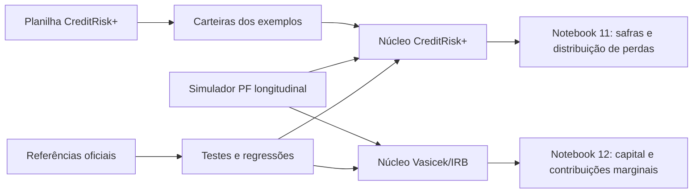

# CreditRisk+ e Vasicek/IRB em Python

Implementação auditável de dois referenciais complementares de risco de crédito, acompanhada de documentação matemática e dez notebooks didáticos em português:

- **CreditRisk+**: distribuição completa de perdas, perda esperada, volatilidade, VaR, capital econômico e contribuições de risco sob a formulação Poisson–Gama do Credit Suisse First Boston;
- **Vasicek/ASRF–IRB**: perda condicional a um fator macroeconômico, capital inesperado no percentil de 99,9%, RWA e contribuições marginais/Euler por contrato;
- **carteira PF longitudinal**: dados sintéticos reprodutíveis de cartão de crédito e crédito pessoal parcelado, com backbook maduro, safras, MOB, ciclo econômico e aplicação mensal dos dois modelos.

O CreditRisk+ é confrontado com o manual e os cinco exemplos da planilha oficial. O Vasicek/IRB segue a derivação ASRF do BCBS e as funções de varejo da Resolução BCB 303. O projeto serve para estudo, reprodução metodológica e prototipação controlada; os parâmetros sintéticos não constituem calibração bancária, autorização IRB, cálculo contábil da Resolução CMN 4.966 nem recomendação de decisão de crédito.

## Navegação rápida

| Objetivo | Ponto de entrada |
|---|---|
| Instalar e validar o projeto | [Instalação e execução](#instalação-e-execução) |
| Entender qual modelo usar | [Como as três camadas se relacionam](#como-as-três-camadas-se-relacionam) |
| Estudar o CreditRisk+ | [Construção matemática](#construção-matemática-do-creditrisk) e notebooks 01–08 |
| Estudar Vasicek, IRB e capital marginal | [Modelo Vasicek/ASRF–IRB](#modelo-vasicekasrfirb) e notebook 12 |
| Reproduzir a carteira PF e as safras | [Camada longitudinal PF](#camada-longitudinal-pf) e notebook 11 |
| Consultar a validação | [Testes e evidências](#testes-e-evidências) |
| Ver ressalvas metodológicas | [Limitações e uso responsável](#limitações-e-uso-responsável) |
| Ver fontes e checksums | [`references/README.md`](references/README.md) |

## Como as três camadas se relacionam

Os dois modelos de risco não são versões concorrentes da mesma conta. Eles respondem perguntas diferentes e compartilham apenas os dados de entrada da carteira PF.

| Camada | Pergunta respondida | Saída principal |
|---|---|---|
| Simulador longitudinal PF | Como uma carteira sintética madura evolui por safra, produto, risco e MOB? | Painel mensal de pools homogêneos com PD, EAD, recuperação, contagens e fatores |
| CreditRisk+ | Qual é a distribuição incondicional de perdas da fotografia da carteira? | PMF, EL, desvio padrão, VaR, capital econômico e contribuições aproximadas ao percentil |
| Vasicek/IRB | Qual é a perda condicional no cenário sistemático adverso e o capital ASRF correspondente? | EL, perda adversa, capital, RWA e contribuição Euler por contrato |



## Estado da implementação

- versão do pacote: `2.0.0`;
- núcleo CreditRisk+ canônico em `creditriskplus/simple_model.py`, reutilizado pela API orientada a objetos;
- núcleo Vasicek/IRB em `creditriskplus/vasicek_irb.py`, com capital e contribuições Euler vetorizadas;
- gerador PF em `creditriskplus/retail.py`, com backbook maduro e gate de convergência antes do reporte;
- cinco exemplos oficiais reproduzidos contra `references/CreditRisk+.xls`;
- quantil discreto separado da interpolação usada exclusivamente para reproduzir a planilha legada;
- massa de cauda truncada exposta e nunca renormalizada silenciosamente;
- dez notebooks executáveis, comentados e validados célula a célula;
- 25 testes matemáticos, regulatórios e regressivos automatizados;
- sete documentos de referência locais, com origem e SHA-256 registrados.

A última execução completa, em 9 de agosto de 2026, aprovou **25/25 testes e 10/10 notebooks**. A auditoria detalhada do núcleo CreditRisk+ está em [AUDITORIA_TECNICA.md](AUDITORIA_TECNICA.md); a matriz atual dos dez estudos, incluindo Vasicek/IRB, está em [notebooks/README.md](notebooks/README.md).

## Referências oficiais incluídas

O diretório `references/` contém:

- [`CreditRisk+.pdf`](references/CreditRisk+.pdf): manual *CreditRisk+ — A Credit Risk Management Framework*;
- [`CreditRisk+.xls`](references/CreditRisk+.xls): planilha oficial com os Exemplos 1A–1C, 2 e 3;
- [`BCB_Resolucao_303_2023_IRB.pdf`](references/BCB_Resolucao_303_2023_IRB.pdf): função regulatória IRB e correlações de varejo;
- [`BIS_Basel_Framework_consolidated.pdf`](references/BIS_Basel_Framework_consolidated.pdf): Basel Framework, incluindo CRE30 e CRE31;
- [`BCBS_IRB_Risk_Weight_Functions_Explanatory_Note_2005.pdf`](references/BCBS_IRB_Risk_Weight_Functions_Explanatory_Note_2005.pdf): derivação ASRF/Vasicek;
- [`CMN_Resolucao_4966_2021_DOU_original.pdf`](references/CMN_Resolucao_4966_2021_DOU_original.pdf): texto original da Resolução CMN 4.966 no DOU;
- [`BCB_Relatorio_Economia_Bancaria_2023.pdf`](references/BCB_Relatorio_Economia_Bancaria_2023.pdf): contexto empírico da carteira PF brasileira.

A implementação CreditRisk+ foi confrontada principalmente com as Seções A3–A5, A7–A13 e com os cinco exemplos da planilha. A Resolução CMN 4.966 é uma referência contábil incluída para consulta, mas **não é implementada como motor de provisão** neste repositório. A proveniência, a ressalva sobre sua consolidação vigente e os checksums estão em [`references/README.md`](references/README.md).

## O que o CreditRisk+ modela

O CreditRisk+ descreve perdas decorrentes de default em um horizonte definido, normalmente um ano. Seus inputs fundamentais são:

- exposição no default, ou EAD;
- probabilidade média de default, ou PD;
- volatilidade da PD ou da intensidade de default;
- recuperação determinística, convertida em LGD;
- participação de cada contraparte nos fatores setoriais.

O resultado é uma distribuição discreta de perdas. A partir dela são calculados perda esperada, desvio padrão, quantis e capital econômico.

O modelo não explica a causa econômica do default e não modela diretamente migração de rating, spreads de mercado, cura, pré-pagamento ou LGD estocástica. Esses fenômenos precisam produzir ou complementar os inputs do CreditRisk+.

## Hipóteses estruturais

1. Defaults condicionais são aproximados por processos de Poisson.
2. As intensidades setoriais variáveis seguem distribuições Gama.
3. Fatores setoriais distintos são independentes na formulação original.
4. Contrapartes que compartilham um fator tornam-se dependentes incondicionalmente.
5. EAD e recuperação são pontuais dentro do horizonte.
6. Severidades são discretizadas em múltiplos inteiros de uma unidade monetária.

Essas hipóteses pertencem ao próprio CreditRisk+. A implementação procura não acrescentar aproximações ocultas além delas.

## Construção matemática do CreditRisk+

### 1. Exposição líquida de recuperação

Para a contraparte \(A\), a severidade líquida é:

$$
L_A = EAD_A(1-RR_A),
$$

onde \(RR_A\) é a taxa de recuperação. A LGD é, portanto, \(1-RR_A\).

### 2. Banding e preservação da perda esperada

Escolhida a unidade monetária \(L\), cada severidade é associada à banda inteira:

$$
\nu_A = \left\lceil\frac{L_A}{L}\right\rceil.
$$

A perda esperada da contraparte em unidades de \(L\) é:

$$
\varepsilon_A = p_A\frac{L_A}{L}.
$$

Como \(\nu_A\) foi arredondado, a frequência usada na distribuição é ajustada para:

$$
\mu_A = \frac{\varepsilon_A}{\nu_A}.
$$

Assim,

$$
\mu_A\nu_A L = p_A L_A,
$$

e a perda esperada original é preservada exatamente apesar do arredondamento. Quando `unit_size=None`, o código segue a convenção da planilha:

$$
L=\left\lceil\frac{\max_A L_A}{100}\right\rceil.
$$

Reduzir \(L\) diminui o efeito do banding sobre a variância, mas aumenta o número de estados calculados.

### 3. Modelo de taxa fixa — limite Poisson

No limite sem volatilidade sistemática, a PGF de perdas da contraparte é:

$$
G_A(z)=\exp\left[\mu_A(z^{\nu_A}-1)\right].
$$

Para a carteira:

$$
G(z)=\exp\left[\sum_A\mu_A(z^{\nu_A}-1)\right].
$$

A probabilidade de perda zero é:

$$
A_0=\exp\left(-\sum_A\mu_A\right),
$$

e não `exp(-sum(epsilon))`. Para \(n>0\), a recursão composta usa as contribuições \(\varepsilon_A\) das bandas elegíveis:

$$
A_n=\frac{1}{n}\sum_{A:\nu_A\le n}\varepsilon_A A_{n-\nu_A}.
$$

### 4. Modelo de taxas variáveis — mistura Poisson–Gama

A variável Gama representa a intensidade agregada do setor, não uma PD Gama independente para cada contrato. Para o setor \(k\), com pesos \(\theta_{Ak}\):

$$
\varepsilon_{Ak}=\theta_{Ak}p_A\frac{L_A}{L},
$$

$$
\mu_k=\sum_A\frac{\varepsilon_{Ak}}{\nu_A},
$$

$$
\sigma_k=\sum_A\theta_{Ak}\sigma_A
\frac{L_A/L}{\nu_A}.
$$

Os parâmetros da Gama, na parametrização forma–escala, são:

$$
\alpha_k=\frac{\mu_k^2}{\sigma_k^2},
\qquad
\beta_k=\frac{\sigma_k^2}{\mu_k},
\qquad
q_k=\frac{\beta_k}{1+\beta_k}.
$$

Definindo a PGF normalizada das severidades do setor como

$$
P_k(z)=\frac{1}{\mu_k}
\sum_A\frac{\varepsilon_{Ak}}{\nu_A}z^{\nu_A},
$$

a PGF setorial é:

$$
G_k(z)=
\left(\frac{1-q_k}{1-q_kP_k(z)}\right)^{\alpha_k}.
$$

Quando \(\sigma_k=0\), essa expressão converge para o limite Poisson. A implementação usa uma forma algébrica estável da recursão A79/A80 e evita produtos indeterminados quando a volatilidade é muito pequena.

### 5. Setores, correlação e setor específico

Cada linha da matriz `sector_weights_matrix` deve conter pesos não negativos que somem um:

$$
\sum_k\theta_{Ak}=1.
$$

As distribuições dos setores independentes são combinadas multiplicando suas PGFs, o que no código corresponde a uma convolução por FFT.

O setor específico da Seção A12.3 mantém sua contribuição média, mas possui volatilidade de fator igual a zero. Por isso ele deve ser informado em `idiosyncratic_sector_indices`; tratá-lo como uma Binomial Negativa individual introduziria correlação e variância inexistentes no manual.

### 6. Momentos analíticos

A perda esperada em moeda é calculada diretamente dos inputs:

$$
EL=\sum_A m_Ap_AL_A,
$$

onde \(m_A\) é a multiplicidade do pool. Em unidades de perda, a variância implementa A115–A118:

$$
\operatorname{Var}(X)=
\sum_A m_A\varepsilon_A\nu_A
+\sum_k
\left(\sum_A m_A\varepsilon_{Ak}\right)^2
\left(\frac{\sigma_k}{\mu_k}\right)^2.
$$

O resultado monetário é obtido multiplicando a expressão por \(L^2\).

### 7. VaR e capital econômico

A PMF calculada é:

$$
A_n=P(X=nL).
$$

O quantil matemático da distribuição discreta é:

$$
VaR_q=\min\left\{nL:\sum_{i=0}^{n}A_i\ge q\right\}.
$$

O capital econômico adotado no projeto é:

$$
EC_q=VaR_q-EL.
$$

`quantile(..., interpolate=False)` retorna o VaR discreto. A opção `interpolate=True` existe exclusivamente para reproduzir a convenção linear do XLS oficial; ela não transforma a variável em contínua.

### 8. Contribuições de risco

A classe `CreditRiskPlus` implementa:

- contribuição analítica ao desvio padrão conforme A121, aditiva até precisão numérica;
- aproximação de contribuição ao percentil conforme A102.

A diferença de VaR depois da remoção finita de contratos não é uma contribuição Euler e não deve ser dividida ou somada como se fosse uma alocação marginal.

## Modelo Vasicek/ASRF–IRB

O módulo `creditriskplus/vasicek_irb.py` implementa o modelo gaussiano de um fator e sua especialização IRB de varejo. Ele não calcula a mesma distribuição discreta do CreditRisk+: no limite assintótico de granularidade, a incerteza idiossincrática diversifica e a perda da carteira passa a ser determinada pelo fator sistemático comum.

### 1. Variável latente e cenário macroeconômico

Para cada contrato $i$, a variável de qualidade de crédito é

$$
A_i=\sqrt{R_i}W+\sqrt{1-R_i}\varepsilon_i,
$$

onde $W$ e $\varepsilon_i$ são normais-padrão independentes e $R_i$ é a correlação de ativos. O default ocorre quando

$$
A_i\leq \Phi^{-1}(PD_i).
$$

Logo, condicionada ao cenário $W=w$, a probabilidade de default é

$$
p_i(w)=\Phi\!\left(
\frac{\Phi^{-1}(PD_i)-\sqrt{R_i}w}{\sqrt{1-R_i}}
\right).
$$

O projeto usa a convenção em que $W<0$ representa deterioração econômica. A identidade $E[p_i(W)]=PD_i$ é verificada numericamente por integração de Gauss–Hermite.

### 2. Correlação regulatória de varejo

`retail_asset_correlation` oferece três categorias explícitas:

- `qrre`: rotativo de varejo qualificado, $R=4\%$;
- `residential`: exposição garantida por imóvel residencial, $R=15\%$;
- `other_retail`: demais exposições de varejo, com

$$
R(PD)=0{,}03\,w(PD)+0{,}16[1-w(PD)],
\qquad
w(PD)=\frac{1-e^{-35PD}}{1-e^{-35}}.
$$

No notebook 12, cartão é tratado como QRRE apenas como hipótese do cenário principal e também é recalculado como `other_retail`. Os dados sintéticos não demonstram os requisitos de elegibilidade QRRE.

### 3. Perda adversa, capital e RWA

Para confiança $q=99{,}9\%$, a perda alta corresponde ao fator

$$
w_q=\Phi^{-1}(1-q)=-\Phi^{-1}(q)\approx-3{,}0902.
$$

Para cada contrato ou pool:

$$
EL_i=EAD_i\,LGD_i\,PD_i,
$$

$$
L_i(w_q)=EAD_i\,LGD_i\,p_i(w_q),
$$

$$
C_i=L_i(w_q)-EL_i
=EAD_i\,LGD_i[p_i(w_q)-PD_i],
$$

$$
RWA_i=12{,}5\,C_i.
$$

`calculate_vasicek_irb` devolve esses valores por linha e agregados. Em varejo não há ajuste de maturidade na função implementada.

### 4. Capital marginal e contribuição Euler

Mantendo PD, LGD e $R$ fixos, o capital é linear na EAD. Portanto,

$$
\frac{\partial C}{\partial EAD_i}
=LGD_i[p_i(w_q)-PD_i]
$$

é o capital marginal por unidade adicional de EAD, e

$$
EAD_i\frac{\partial C}{\partial EAD_i}=C_i
$$

é a contribuição Euler exata. Para pools homogêneos, `obligor_count` multiplica essa contribuição sem aproximação adicional; a equivalência com a expansão contrato a contrato é testada automaticamente.

### 5. Fronteira de interpretação

O valor ASRF/IRB não inclui risco de concentração finita, erro de estimação, múltiplos fatores correlacionados, ajuste gerencial, buffers, tributos ou requisitos adicionais de supervisão. Os pisos de PD/LGD e a transformação TTC usados no notebook 12 pertencem ao cenário didático e ficam fora da função genérica, que recebe os parâmetros já preparados.

## Controles numéricos

### Truncamento

A distribuição possui suporte potencialmente infinito. `max_loss_dollars` limita apenas o domínio calculado. O código retorna:

- `tail_mass_upper_bound = 1 - sum(pmf)`;
- `pmf_expected_loss`, a EL capturada no domínio truncado;
- `expected_loss`, a EL exata dos inputs.

A PMF não é renormalizada. Se a CDF truncada não alcançar a confiança solicitada, o cálculo do quantil lança erro.

### FFT

A FFT é usada somente para convoluir distribuições setoriais. Resíduos negativos inferiores a `1e-15` são tratados como ruído numérico. Probabilidades negativas materiais geram exceção, e nenhuma reescala posterior é aplicada.

### Underflow

Quando a probabilidade de perda zero não cabe em `float64`, a recursão é executada em log-espaço. Isso preserva a massa em torno do modo em carteiras com frequência agregada elevada.

### Pools homogêneos

`obligor_counts=m_A` comprime contratos com EAD, PD, volatilidade, recuperação e pesos setoriais idênticos. Multiplicar suas contribuições por \(m_A\) é algebricamente equivalente a repetir as linhas. A homogeneidade dentro do pool, contudo, é uma decisão de segmentação que precisa ser validada em uso real.

## Instalação e execução

As versões fixadas em `requirements.txt` requerem **Python 3.11 ou superior**. A validação mais recente foi executada com Python 3.14.6, NumPy 2.4.4, SciPy 1.17.1 e pandas 3.0.2.

```bash
git clone https://github.com/hoteixeira/credit-risk-plus.git
cd credit-risk-plus
python -m venv venv
source venv/bin/activate
python -m pip install --upgrade pip
python -m pip install -r requirements.txt
```

No Windows PowerShell, a ativação equivalente é:

```powershell
venv\Scripts\Activate.ps1
```

Como o projeto ainda não é distribuído como pacote PyPI, execute scripts e notebooks a partir da raiz clonada. O fluxo mínimo de verificação é:

```bash
python run_tests.py
python test_notebooks.py
jupyter lab
```

`run_tests.py` executa a suíte matemática e as regressões contra a planilha. `test_notebooks.py` abre cada notebook em memória, executa todas as células com timeout individual de 600 segundos e não sobrescreve os arquivos versionados.

## API CreditRisk+ — uso funcional

Para aplicações novas, prefira a API detalhada:

```python
import numpy as np

from creditriskplus import data
from creditriskplus.simple_model import calculate_loss_distribution_detailed

portfolio = data.create_example_1a_portfolio()

result = calculate_loss_distribution_detailed(
    exposures=portfolio["exposure"].to_numpy(),
    mean_default_rates=portfolio["mean_default_rate"].to_numpy(),
    std_default_rates=portfolio["std_default_rate"].to_numpy(),
    recovery_rates=np.zeros(len(portfolio)),
    max_loss_dollars=250_000_000,
)

print(f"Unidade: {result.unit_size:,.0f}")
print(f"EL: {result.expected_loss:,.2f}")
print(f"VaR99 discreto: {result.quantile(0.99):,.2f}")
print(f"VaR99 interpolado como XLS: {result.quantile(0.99, interpolate=True):,.2f}")
print(f"Massa truncada: {result.tail_mass_upper_bound:.3e}")
```

Resultado esperado para o Exemplo 1A:

```text
Unidade: 202.389
EL: 14.221.863,48
VaR99 discreto: 55.454.586,00
VaR99 interpolado como XLS: 55.311.503,38
Massa truncada: aproximadamente 1,1e-12
```

A função histórica `calculate_loss_distribution` continua disponível e retorna apenas `(pmf, expected_loss)`. Para cálculos novos, use o retorno detalhado, pois ele torna truncamento e parâmetros setoriais auditáveis.

### Parâmetros da API principal

```python
result = calculate_loss_distribution_detailed(
    exposures,
    mean_default_rates,
    std_default_rates,
    recovery_rates,
    sector_weights_matrix=None,
    idiosyncratic_sector_indices=None,
    unit_size=None,
    max_loss_dollars=150_000_000,
    obligor_counts=None,
)
```

| Parâmetro | Significado |
|---|---|
| `exposures` | EAD bruta por contraparte ou pool, em uma única moeda |
| `mean_default_rates` | PD média no horizonte, entre zero e um |
| `std_default_rates` | Desvio padrão da PD ou intensidade de default, não negativo |
| `recovery_rates` | Taxa de recuperação determinística, entre zero e um |
| `sector_weights_matrix` | Matriz `N × K`; cada linha deve somar um |
| `idiosyncratic_sector_indices` | Índices dos setores específicos sujeitos ao limite Poisson de A12.3 |
| `unit_size` | Unidade monetária do banding; `None` aplica a convenção do XLS |
| `max_loss_dollars` | Maior perda monetária incluída no domínio computado |
| `obligor_counts` | Multiplicidade inteira não negativa de cada pool homogêneo |

### Uso da classe orientada a objetos

```python
from creditriskplus import CreditRiskPlus, data

portfolio = data.create_example_3_4sector_portfolio()
sector_columns = [
    column for column in portfolio.columns
    if column.startswith("sector_weight_")
]

model = CreditRiskPlus(max_loss_units=2_000)
model.set_portfolio(
    portfolio,
    sector_columns=sector_columns,
    idiosyncratic_sector_columns=["sector_weight_Specific"],
)
model.calculate_loss_distribution()

print(model.summary())
contributions = model.calculate_risk_contributions(percentile=99)
```

`model.py` é uma fachada sobre `simple_model.py`; não existe uma segunda recursão matemática independente.

## API Vasicek/IRB — capital e marginal

O exemplo abaixo trata cada linha como um pool homogêneo. A primeira linha é cartão sob hipótese QRRE; a segunda é crédito parcelado classificado como demais varejo.

```python
import numpy as np

from creditriskplus import calculate_vasicek_irb, retail_asset_correlation

pd = np.array([0.020, 0.080])
ead_por_contrato = np.array([3_500.0, 9_000.0])
lgd = np.array([0.85, 0.78])
categoria = np.array(["qrre", "other_retail"])
quantidade = np.array([1_000, 500])

correlacao = retail_asset_correlation(pd, categoria)
result = calculate_vasicek_irb(
    pd=pd,
    ead_per_obligor=ead_por_contrato,
    lgd=lgd,
    asset_correlation=correlacao,
    obligor_count=quantidade,
    confidence=0.999,
)

print(f"EAD: {result.total_ead:,.2f}")
print(f"EL: {result.total_expected_loss:,.2f}")
print(f"Perda adversa: {result.total_adverse_loss:,.2f}")
print(f"Capital: {result.total_capital:,.2f}")
print(f"RWA: {result.total_rwa:,.2f}")
print("Capital marginal por real de EAD:", result.marginal_capital_per_ead)
print("Contribuição Euler dos pools:", result.capital_pool)
```

As funções públicas do módulo são:

| Função/objeto | Finalidade |
|---|---|
| `retail_asset_correlation` | Aplica as correlações QRRE, residencial ou demais varejo |
| `conditional_default_probability` | Calcula $P(default\mid W=w)$ contrato a contrato |
| `downturn_default_probability` | Obtém a PD condicional no cenário associado ao quantil escolhido |
| `conditional_portfolio_loss` | Soma a perda condicional da carteira para um valor arbitrário de $W$ |
| `calculate_vasicek_irb` | Calcula EL, perda adversa, capital, RWA e contribuições marginais/Euler |
| `VasicekIRBResult` | Estrutura imutável com vetores por linha e propriedades agregadas |

## Camada longitudinal PF

`creditriskplus/retail.py` gera um painel sintético determinístico a partir de `RetailSimulationConfig`. As linhas representam pools homogêneos; `obligor_count` é a quantidade de contratos representada por cada linha.

```python
from creditriskplus.retail import (
    RetailSimulationConfig,
    run_creditriskplus_over_time,
    simulate_retail_portfolio,
    validate_portfolio_regime,
    vintage_default_curves,
)

config = RetailSimulationConfig(
    reporting_start="2023-01-01",
    reporting_months=24,
    backbook_months=180,
    burn_in_months=12,
    vintage_performance_months=60,
    seed=20260808,
)

panel = simulate_retail_portfolio(config)
diagnostics = validate_portfolio_regime(panel, config)
monthly_risk = run_creditriskplus_over_time(panel, config)
vintages = vintage_default_curves(panel, config)
```

O fluxo é deliberadamente sequencial:

1. `simulate_retail_portfolio` reconstrói as safras históricas sobreviventes, mantém uma cauda madura de cartão e simula originação, default e saída;
2. `validate_portfolio_regime` compara fechamentos sazonais equivalentes e interrompe o estudo se nível, EL/EAD, mix ou distribuição etária ainda estiverem convergindo;
3. `run_creditriskplus_over_time` calcula 24 fotografias da distribuição de perdas, ampliando automaticamente a cauda até atender à tolerância;
4. `vintage_default_curves` acompanha todas as 24 safras reportadas até o mesmo MOB 60, evitando censura desigual.

O notebook 12 chama o mesmo gerador e a mesma semente do notebook 11. Assim, a comparação entre CreditRisk+ e Vasicek/IRB muda o método de risco, não a carteira subjacente.

## Estrutura do repositório

```text
credit-risk-plus/
├── creditriskplus/
│   ├── simple_model.py       # núcleo matemático canônico
│   ├── model.py              # fachada orientada a objetos
│   ├── variable_model.py     # compatibilidade legada com aviso de depreciação
│   ├── retail.py             # simulação longitudinal da carteira PF
│   ├── vasicek_irb.py        # modelo de um fator, capital IRB e contribuições Euler
│   ├── data.py               # portfólios dos exemplos oficiais
│   └── plots.py              # funções auxiliares de visualização
├── notebooks/
│   ├── 01_introducao.ipynb
│   ├── 02_modelo_fixo.ipynb
│   ├── 03_modelo_variavel.ipynb
│   ├── 04_exemplo_1A.ipynb
│   ├── 05_exemplo_1B.ipynb
│   ├── 06_exemplo_1C_multi_ano.ipynb
│   ├── 07_exemplo_2_setores_geo.ipynb
│   ├── 08_exemplo_3_setores_fracionarios.ipynb
│   ├── 11_safras_pf_brasil_creditriskplus.ipynb
│   ├── 12_vasicek_irb_pf.ipynb
│   └── README.md             # parecer individual dos notebooks
├── scripts/
│   └── build_notebook_12.py  # fonte reprodutível do notebook Vasicek/IRB
├── references/
│   ├── README.md             # proveniência e checksums dos documentos
│   ├── BCB_Relatorio_Economia_Bancaria_2023.pdf
│   ├── BCB_Resolucao_303_2023_IRB.pdf
│   ├── BIS_Basel_Framework_consolidated.pdf
│   ├── BCBS_IRB_Risk_Weight_Functions_Explanatory_Note_2005.pdf
│   ├── CMN_Resolucao_4966_2021_DOU_original.pdf
│   ├── CreditRisk+.pdf
│   └── CreditRisk+.xls
├── wiki/                     # documentação temática complementar
├── AUDITORIA_TECNICA.md
├── extract_expected.py
├── run_tests.py
├── test_notebooks.py
└── requirements.txt
```

## Roteiro dos notebooks

Os notebooks 01–03 apresentam a teoria, 04–08 reproduzem os exemplos oficiais, o notebook 11 aplica o CreditRisk+ a uma carteira PF longitudinal e o notebook 12 reutiliza essa carteira no modelo Vasicek/IRB.

| Trilha | Ordem sugerida | Resultado |
|---|---|---|
| Fundamentos CreditRisk+ | 01 → 02 → 03 | Hipóteses, banding, Poisson e mistura Poisson–Gama |
| Conformidade com a referência | 04 → 05 → 06 → 07 → 08 | Reprodução dos cinco exemplos oficiais |
| Carteira PF e safras | 11 | Distribuição de perdas e capital econômico ao longo do tempo |
| Capital regulatório e marginal | 12 | Vasicek/IRB, RWA e contribuições Euler por contrato |

### 01 — Introdução

[Abrir notebook](notebooks/01_introducao.ipynb)

Explica a natureza paramétrica e analítica do CreditRisk+, suas hipóteses, a PGF de perdas, a dependência setorial e as diferenças entre EL, VaR e capital econômico. Também separa aproximações estruturais de erros de implementação.

### 02 — Modelo de taxa fixa

[Abrir notebook](notebooks/02_modelo_fixo.ipynb)

Deriva o limite Poisson, o banding, a preservação da EL e a recursão composta. A implementação é confrontada com massa, média e variância analíticas.

### 03 — Modelo de taxas variáveis

[Abrir notebook](notebooks/03_modelo_variavel.ipynb)

Mostra a mistura Poisson–Gama e a Binomial Negativa setorial. Destaca que a variável Gama pertence à intensidade comum do setor, não a PDs individuais independentes, e compara os limites fixo e variável.

### 04 — Exemplo oficial 1A

[Abrir notebook](notebooks/04_exemplo_1A.ipynb)

Reproduz a carteira oficial de 25 contrapartes e um fator. Valida EL, VaR99 interpolado, quantil discreto, momentos e contribuições de risco A121/A102.

### 05 — Exemplo oficial 1B

[Abrir notebook](notebooks/05_exemplo_1B.ipynb)

Remove as duas maiores exposições da carteira 1A e reproduz o XLS. O estudo distingue redução finita do risco de contribuições marginais ou Euler.

### 06 — Exemplo oficial 1C multi-ano

[Abrir notebook](notebooks/06_exemplo_1C_multi_ano.ipynb)

Reproduz a construção de contrapartes virtuais do exemplo de três anos. O notebook documenta por que essa construção não substitui um modelo completo de migração e dependência temporal.

### 07 — Exemplo oficial 2

[Abrir notebook](notebooks/07_exemplo_2_setores_geo.ipynb)

Aplica três setores geográficos exclusivos — Estados Unidos, Japão e Europa — e demonstra a combinação das distribuições setoriais independentes.

### 08 — Exemplo oficial 3

[Abrir notebook](notebooks/08_exemplo_3_setores_fracionarios.ipynb)

Aplica pesos fracionários em quatro setores e o setor específico de A12.3. A variância do fator específico é zerada literalmente, eliminando a divergência que existia em versões anteriores.

### 11 — Safras PF brasileiras

[Abrir notebook](notebooks/11_safras_pf_brasil_creditriskplus.ipynb)

Estudo sintético de cartão de crédito e crédito pessoal parcelado com:

- backbook inicial com 180 safras históricas explícitas;
- pool de cauda para cartões anteriores ao histórico explícito;
- 12 meses de burn-in;
- 24 safras e 24 fechamentos CreditRisk+ reportados;
- acompanhamento homogêneo das 24 safras até MOB 60;
- quatro faixas de risco e fatores específico, macro, cartão e parcelado;
- seasoning, utilização, amortização, defaults, saídas e originação;
- choque macroeconômico, contração de oferta e tightening de underwriting;
- EL, desvio padrão, VaR95/99/99,9, capital econômico e massa truncada;
- tabelas executivas, séries temporais, heatmap e curvas de vintage.

O estoque não começa vazio. Antes do reporte, um gate compara dois fechamentos sazonais equivalentes em:

- EAD e clientes ativos;
- EL/EAD;
- participação de produto;
- distribuição de EAD por faixas de MOB.

Se os limites configurados não forem atendidos, `run_creditriskplus_over_time` interrompe a execução. O cenário validado apresentou EAD pré-reporte de `+0,31%`, clientes de `+0,48%`, EL/EAD de `+0,11 p.p.`, mudança máxima de mix de `0,29 p.p.` e distância etária de `0,36%`, eliminando o crescimento artificial de aproximadamente 90% da versão iniciada sem backbook.

Originação e eventos de performance usam fluxos pseudoaleatórios independentes. Assim, ampliar o horizonte de vintage não altera defaults já realizados nos 24 meses reportados. Todas as curvas chegam ao mesmo MOB 60; as antigas aparecem mais transparentes e as recentes mais opacas.

O cartão não possui vencimento contratual e pode continuar acumulando defaults depois do MOB 60. O horizonte comum remove censura desigual, mas não impõe artificialmente um platô.

### 12 — Vasicek/IRB e capital marginal

[Abrir notebook](notebooks/12_vasicek_irb_pf.ipynb)

Reutiliza literalmente a configuração e a semente do notebook 11, mas aplica o modelo gaussiano de um fator e as funções IRB de varejo da Resolução BCB 303. O estudo contém:

- derivação da variável latente e da PD condicional a um fator macroeconômico `W`;
- prova numérica de que a média das PDs condicionais recupera a PD incondicional;
- separação entre PD de longo prazo (TTC) e PD cíclica (PIT);
- correlação fixa de 4% para cartão sob hipótese QRRE e correlação dependente da PD para parcelados classificados como demais varejo;
- aplicação explícita dos pisos de PD e LGD do cenário regulatório;
- EL, perda condicional no percentil de 99,9%, capital inesperado e RWA em 24 fechamentos;
- contribuição marginal por real de EAD e contribuição Euler de cada contrato ativo;
- reconciliação exata entre contratos, pools, segmentos e carteira;
- cenários do fator sistemático, sensibilidade à classificação QRRE e validação Monte Carlo do quantil ASRF;
- gráficos temporais, decomposições, heatmap, curva de concentração e superfícies de sensibilidade.

O notebook trata o cartão como QRRE apenas para construir o cenário principal e calcula também a alternativa conservadora de “demais varejo”. Os dados sintéticos não comprovam elegibilidade regulatória, não constituem calibração aprovada de PD/LGD/EAD e não incorporam risco de concentração finita. Essas limitações aparecem antes dos cálculos e nas conclusões, em vez de serem absorvidas por ajustes ad hoc.

O arquivo [`scripts/build_notebook_12.py`](scripts/build_notebook_12.py) é a fonte textual reprodutível do notebook 12. Para reconstruí-lo deliberadamente:

```bash
python scripts/build_notebook_12.py
```

O comando substitui o `.ipynb` correspondente; execute `python test_notebooks.py` depois e confira o diff antes de versionar.

## Notebooks excluídos

Dois notebooks antigos foram removidos durante a auditoria:

- `09_aplicacoes.ipynb`: misturava outputs do CreditRisk+ com regras não calibradas de provisão, limite, preço e RARoC;
- `10_simulacao_portfolio_varejo.ipynb`: era apenas um aviso de substituição, sem análise executável.

As justificativas completas estão em [notebooks/README.md](notebooks/README.md).

## Regressão contra a planilha oficial

A validação não se limita a dois KPIs por exemplo. É confrontado tudo o que a planilha e o manual publicam — inclusive a distribuição inteira, ponto a ponto.

| Verificação | Cobertura | Tolerância automatizada |
|---|---|---|
| PMF publicada, ponto a ponto | 5 exemplos, 2.331 pontos de grade | 5×10⁻⁷ (precisão de impressão do XLS) |
| Percentis publicados | 5 exemplos × 8 percentis | menor que 1 unidade monetária |
| Perda esperada | 5 exemplos | menor que 1 unidade monetária |
| Desvio padrão (manual, B3.4) | Exemplo 1A: 12.668.742 | menor que 1 |
| Contribuições de risco | 1A, 1B, 2 e 3 — 98 contrapartes | erro relativo menor que 10⁻⁵ |

KPIs de referência por exemplo:

| Exemplo | EL oficial | VaR99 oficial |
|---|---:|---:|
| 1A | 14.221.863 | 55.311.503 |
| 1B | 11.162.856 | 39.946.857 |
| 1C | 17.277.632 | 62.100.307 |
| 2 | 14.221.863 | 49.931.502 |
| 3 | 14.221.863 | 47.368.235 |

A comparação de VaR usa a interpolação linear da planilha; a API econômica continua usando o quantil discreto por padrão.

As contribuições de risco têm duas convenções, porque a equação 121 do manual não especifica se a PD é a bruta do rating ou a compensada pelo banding. `convention="manual"` (padrão) usa a compensada e é aditiva por construção; `convention="spreadsheet"` reproduz o XLS. A diferença por contraparte chega a 5% e está documentada em [AUDITORIA_TECNICA.md](AUDITORIA_TECNICA.md) seção 6.1.

## Testes e evidências

Execute as identidades matemáticas e regressões contra o XLS:

```bash
python run_tests.py
```

A suíte contém 25 testes e cobre, entre outros pontos:

1. limite Poisson contra a PMF fechada;
2. momentos da PMF contra A115–A118;
3. preservação da EL depois do banding;
4. validação de pesos e inputs;
5. equivalência entre API funcional e classe;
6. equivalência entre pools homogêneos e expansão linha a linha;
7. subfluxo numérico de \(A_0\) em carteiras grandes;
8. a PMF publicada dos cinco exemplos, ponto a ponto;
9. os quarenta percentis publicados;
10. o desvio padrão impresso no manual;
11. as contribuições de risco publicadas, na convenção da planilha;
12. aditividade da convenção do manual e rejeição de convenções desconhecidas;
13. maturidade do backbook PF;
14. horizonte comum de MOB 60;
15. invariância dos eventos reportados quando o horizonte de vintage é ampliado;
16. integração numérica de $E[P(default\mid W)]=PD$;
17. limites e categorias da correlação regulatória de varejo;
18. igualdade entre pools Vasicek/IRB e expansão contrato a contrato;
19. capital marginal analítico contra diferença finita em EAD;
20. reconciliação $C=L_{\mathrm{adversa}}-EL$ e $RWA=12{,}5\times C$.

Execute todos os notebooks em memória:

```bash
python test_notebooks.py
```

O segundo comando é mais lento porque recalcula todas as distribuições e gráficos dos estudos longitudinais. Na validação mais recente, os dez notebooks executaram sem erro.

Para abrir os estudos interativamente:

```bash
jupyter lab
```

## Limitações e uso responsável

- A aproximação Poisson é menos adequada para PDs muito altas ou carteiras pequenas.
- Recuperação e EAD são determinísticas dentro de cada fotografia.
- Fatores Gama setoriais são independentes.
- O banding preserva EL, mas pode alterar a variância; unidades menores reduzem esse efeito.
- VaR não é uma medida coerente e deve ser complementado por stress testing e outras métricas.
- A102 fornece uma aproximação de contribuição ao percentil, não uma decomposição exata de VaR.
- O exemplo multi-ano oficial não é um modelo completo de transição temporal.
- A carteira PF usa parâmetros sintéticos, não estimativas extraídas diretamente das séries do Banco Central.
- O limite ASRF pressupõe granularidade suficiente para diversificar o risco idiossincrático; concentração finita exige tratamento adicional.
- A classificação de cartão como QRRE no notebook 12 é uma hipótese de sensibilidade, não evidência de elegibilidade regulatória.
- O capital IRB não inclui buffers, requisitos adicionais, risco de modelo nem efeitos de uma arquitetura multifator.
- A Resolução CMN 4.966 trata reconhecimento, mensuração e perda esperada contábil; o projeto a inclui como referência, mas não implementa toda a metodologia contábil nem a confunde com capital inesperado.
- Uso real exige calibração interna, tratamento de censura, backtesting, validação fora da amostra, estabilidade e governança.

## Documentação complementar

A Wiki documenta o núcleo CreditRisk+ e seus exemplos. Para Vasicek/IRB, use esta página, o notebook 12, as docstrings de `vasicek_irb.py` e os documentos regulatórios locais.

- [Visão geral](wiki/01-Visao-Geral.md)
- [Dados de entrada](wiki/02-Dados-de-Entrada.md)
- [Modelo de taxa fixa](wiki/03-Modelo-Taxa-Fixa-Poisson.md)
- [Modelo de taxas variáveis](wiki/04-Modelo-Taxa-Variavel-NB.md)
- [Setores e correlação](wiki/05-Setores-e-Correlacao.md)
- [Extensão multi-ano](wiki/06-Multi-Ano.md)
- [Capital econômico](wiki/07-Capital-Economico.md)
- [Aplicações](wiki/08-Aplicacoes.md)
- [Implementação Python](wiki/09-Implementacao-Python.md)
- [Validação](wiki/10-Validacao.md)
- [Referências](wiki/11-Referencias.md)
- [Auditoria matemática do CreditRisk+](AUDITORIA_TECNICA.md)
- [Matriz de validação dos notebooks](notebooks/README.md)
- [Proveniência e checksums das referências](references/README.md)

## Referências bibliográficas principais

Credit Suisse Financial Products. *CreditRisk+: A Credit Risk Management Framework*. Credit Suisse First Boston International, 1997.

Basel Committee on Banking Supervision. *An Explanatory Note on the Basel II IRB Risk Weight Functions*. Bank for International Settlements, 2005.

Banco Central do Brasil. *Resolução BCB nº 303, de 16 de março de 2023*.

Conselho Monetário Nacional. *Resolução CMN nº 4.966, de 25 de novembro de 2021* — publicação original; consultar a consolidação vigente no portal do BCB.

Os direitos sobre os documentos e a planilha pertencem aos respectivos titulares. Os arquivos são utilizados como referência metodológica, regulatória e de reprodução dos exemplos.
